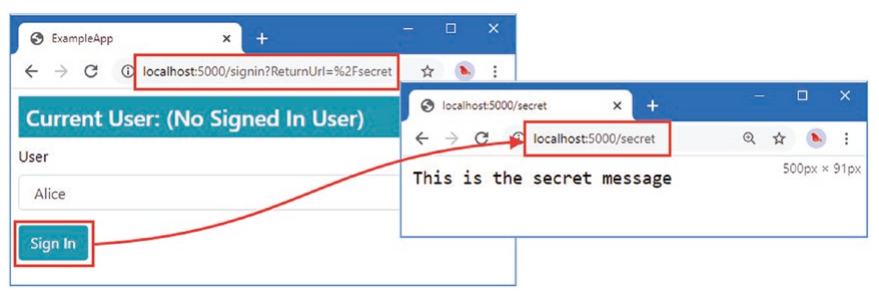

1-Introduction to Authentication
==============================

## Custom Middleware Approach V1

```C#
//------------------V
public class Startup
{
    public void ConfigureServices(IServiceCollection services)
    {
        // ...
    }

    public void Configure(IApplicationBuilder app, IWebHostEnvironment env)
    {
        app.UseMiddleware<CustomAuthentication>();

        app.UseMiddleware<RoleMemberships>();

        app.UseRouting();

        app.UseMiddleware<CustomAuthorization>();

        app.UseEndpoints(endpoints => {
            endpoints.MapGet("/secret", SecretEndpoint.Endpoint).WithDisplayName("secret");
        });
    }
}
//------------------Ʌ

//-------------------------------V
public class CustomAuthentication
{
    private RequestDelegate next;

    public CustomAuthentication(RequestDelegate requestDelegate)
    {
        next = requestDelegate;
    }

    // an initial HttpContext contains a default asp.net auto-created ClaimsPrincipal which has auto-created ClaimsIdentity (IsAuthenticated is false) that has 0 claims
    public async Task Invoke(HttpContext context)  
    {
        string user = context.Request.Query["user"];
        if (user != null)
        {
            Claim claim = new Claim(ClaimTypes.Name, user);
            ClaimsIdentity ident = new ClaimsIdentity("QueryStringValue");
            ident.AddClaim(claim);
            context.User = new ClaimsPrincipal(ident);
        }
        await next(context);
    }
}
//-------------------------------Ʌ

//-------------------------------V
public class CustomAuthorization
{
    private RequestDelegate next;

    public CustomAuthorization(RequestDelegate requestDelegate) => next = requestDelegate;

    public async Task Invoke(HttpContext context)
    {
        if (context.GetEndpoint()?.DisplayName == "secret")
        {
            if (context.User.Identity.IsAuthenticated)
            {
                if (context.User.IsInRole("Administrator"))               
                    await next(context);
                else
                    Forbid(context);
            }
            else
                Challenge(context);
        }
        else
            await next(context);
    }

    public void Challenge(HttpContext context) => context.Response.StatusCode = StatusCodes.Status401Unauthorized;
    public void Forbid(HttpContext context) => context.Response.StatusCode = StatusCodes.Status403Forbidden;
}
//-------------------------------Ʌ

//-------------------------------->>
public static class UsersAndClaims
{
    public static Dictionary<string, IEnumerable<string>> UserData =
        new Dictionary<string, IEnumerable<string>> {
                { "Alice", new [] { "User", "Administrator" } },
                { "Bob", new [] { "User" } },
                { "Charlie", new [] { "User"} }
    };
    public static string[] Users => UserData.Keys.ToArray();
    public static Dictionary<string, IEnumerable<Claim>> Claims =>
        UserData.ToDictionary(kvp => kvp.Key, kvp => kvp.Value.Select(role => new Claim(ClaimTypes.Role, role)), StringComparer.InvariantCultureIgnoreCase);
}
//--------------------------------<<

//--------------------------V
public class RoleMemberships
{
    private RequestDelegate next;

    public RoleMemberships(RequestDelegate requestDelegate) =>
        next = requestDelegate;

    public async Task Invoke(HttpContext context)
    {
        IIdentity mainIdent = context.User.Identity;
        if (mainIdent.IsAuthenticated && UsersAndClaims.Claims.ContainsKey(mainIdent.Name))
        {
            ClaimsIdentity ident = new ClaimsIdentity("Role");
            ident.AddClaim(new Claim(ClaimTypes.Name, mainIdent.Name));
            ident.AddClaims(UsersAndClaims.Claims[mainIdent.Name]);
            context.User.AddIdentity(ident);
        }
        await next(context);
    }
}
//--------------------------Ʌ

//-------------------------V
public class SecretEndpoint
{
    public static async Task Endpoint(HttpContext context)
    {
        await context.Response.WriteAsync("This is the secret message");
    }
}
//-------------------------Ʌ
```

=============================================================================================================

## Build-in Middleware Approach

```C#
//------------------V
public class Startup
{

    public void ConfigureServices(IServiceCollection services)
    {
        services.AddAuthentication(opts =>   // opts is AuthenticationOptions
        {
            opts.AddScheme<AuthHandler>("qsv", "QueryStringValue");   // <--------------------
            opts.DefaultScheme = "qsv";   // <--------------------
        });
        services.AddAuthorization();
    }

    public void Configure(IApplicationBuilder app, IWebHostEnvironment env)
    {
        //app.UseMiddleware<CustomAuthentication>();
        app.UseAuthentication();

        app.UseMiddleware<RoleMemberships>();

        app.UseRouting();

        app.UseMiddleware<ClaimsReporter>();

        //app.UseMiddleware<CustomAuthorization>();
        app.UseAuthorization();

        app.UseEndpoints(endpoints => {
            endpoints.MapGet("/", async context => {
                await context.Response.WriteAsync("Hello World!");
            });
            endpoints.MapGet("/secret", SecretEndpoint.Endpoint).WithDisplayName("secret");

            endpoints.Map("/signin", CustomSignInAndSignOut.SignIn);
            endpoints.Map("/signout", CustomSignInAndSignOut.SignOut);
        });
    }
}
//------------------Ʌ

//-------------------------V
public class SecretEndpoint
{
    [Authorize(Roles = "Administrator")]
    public static async Task Endpoint(HttpContext context)
    {
        await context.Response.WriteAsync("This is the secret message");
    }
}
//-------------------------Ʌ

//----------------------V
public class AuthHandler : IAuthenticationHandler
{
    private HttpContext context;
    private AuthenticationScheme scheme;

    public Task InitializeAsync(AuthenticationScheme authScheme, HttpContext httpContext)
    {
        scheme = authScheme;
        
        context = httpContext;  // <-----------------although you can access httpContext here and potentially set a ClaimsPrincipal on httpContext.User in AuthenticateAsync
                                // but you are not supposed to do it becuase the patter is you create a AuthenticationTicket that contains a ClaimsPrincipal and you pass this
                                // ticket to AuthenticateResult and let AuthenticationMiddleware set the principal (read from the AuthenticateResult) to the HttpContext.User
        
        return Task.CompletedTask;
    }

    public Task<AuthenticateResult> AuthenticateAsync()   // <--------------------called by AuthenticationMiddleware when default scheme applied
    {
        AuthenticateResult result;
        string user = context.Request.Cookies["authUser"];
        if (user != null)
        {
            Claim claim = new Claim(ClaimTypes.Name, user);
            ClaimsIdentity ident = new ClaimsIdentity(scheme.Name);
            ident.AddClaim(claim);
            result = AuthenticateResult.Success(new AuthenticationTicket(new ClaimsPrincipal(ident), scheme.Name));
        }
        else
        {
            result = AuthenticateResult.NoResult();
        }
        return Task.FromResult(result);
    }

    public Task ChallengeAsync(AuthenticationProperties properties)  // <----------------will be called by AuthorizationMiddleware when condition meet
    {
        context.Response.StatusCode = StatusCodes.Status401Unauthorized;
        return Task.CompletedTask;
    }
    public Task ForbidAsync(AuthenticationProperties properties)    // <----------------will be called by AuthorizationMiddleware when condition meet
    {
        context.Response.StatusCode = StatusCodes.Status403Forbidden;
        return Task.CompletedTask;
    }
}
//----------------------Ʌ
```

## V2

```C#
//------------------V
public class Startup
{
    public void ConfigureServices(IServiceCollection services)
    {
        services.AddAuthentication(opts =>  // opts is AuthenticationOptions
        {
           opts.AddScheme<AuthHandler>("qsv", "QueryStringValue");
           opts.DefaultScheme = "qsv";
        });
        // ...
    }

    public void Configure(IApplicationBuilder app, IWebHostEnvironment env)
    {
        //app.UseMiddleware<CustomAuthentication>();
        app.UseAuthentication();
        
        app.UseMiddleware<RoleMemberships>();

        app.UseRouting();

        //app.UseMiddleware<CustomAuthorization>();
        app.UseAuthorization();

        app.UseEndpoints(endpoints => {
            //endpoints.Map("/signin", CustomSignInAndSignOut.SignIn);
            //endpoints.Map("/signout", CustomSignInAndSignOut.SignOut);
            endpoints.MapGet("/secret", SecretEndpoint.Endpoint).WithDisplayName("secret");
            // ...
        });
    }
}
//------------------Ʌ

//-------------------------V
public class SecretEndpoint
{
    [Authorize(Roles = "Administrator")]
    public static async Task Endpoint(HttpContext context)
    {
        await context.Response.WriteAsync("This is the secret message");
    }
}
//-------------------------Ʌ
```

```C#
//----------------------V
public class AuthHandler : IAuthenticationSignInHandler
{
    private HttpContext context;
    private AuthenticationScheme scheme;

    public Task InitializeAsync(AuthenticationScheme authScheme, HttpContext httpContext)
    {
        context = httpContext;
        scheme = authScheme;
        return Task.CompletedTask;
    }

    public Task<AuthenticateResult> AuthenticateAsync()  
    {
        AuthenticateResult result;
        string user = context.Request.Cookies["authUser"];
        if (user != null)
        {
            Claim claim = new Claim(ClaimTypes.Name, user);
            ClaimsIdentity ident = new ClaimsIdentity(scheme.Name);
            ident.AddClaim(claim);
            result = AuthenticateResult.Success(new AuthenticationTicket(new ClaimsPrincipal(ident), scheme.Name));
        }
        else
        {
            result = AuthenticateResult.NoResult();
        }
        return Task.FromResult(result);
    }

    public Task SignInAsync(ClaimsPrincipal user, AuthenticationProperties properties)
    {
        context.Response.Cookies.Append("authUser", user.Identity.Name);
        return Task.CompletedTask;
    }

    public Task SignOutAsync(AuthenticationProperties properties)
    {
        context.Response.Cookies.Delete("authUser");
        return Task.CompletedTask;
    }

    public Task ChallengeAsync(AuthenticationProperties properties)
    {
        //context.Response.StatusCode = StatusCodes.Status401Unauthorized;
        context.Response.Redirect("/signin/401");
        return Task.CompletedTask;
    }

    public Task ForbidAsync(AuthenticationProperties properties)
    {
        //context.Response.StatusCode = StatusCodes.Status403Forbidden;
        context.Response.Redirect("/signin/403");
        return Task.CompletedTask;
    }
}
//----------------------Ʌ
```


## V3- Use Built-In Cookie Authentication Handler `CookieAuthenticationHandler`

Note that even you "register" multiple schemes via `AddCookie` and something like `AddJwtBearer`... etc, only the default schema's handler (`IAuthenticationHandler`) will be called by `AuthenticationMiddleware`, non-default schema's handlers will only be called by `AuthorizationMiddleware`. so counter-intuitively, _when you're using 2 or more authentication-schemes then the AuthorizationMiddleware will perform double-duty and also authenticate requests in addition to authorizing them.

```C#
//------------------V
public class Startup
{
    public void ConfigureServices(IServiceCollection services)
    {
        //services.AddAuthentication(opts =>
        //{
        //    opts.AddScheme<AuthHandler>("qsv", "QueryStringValue");  // note that AddScheme is not related to DI, .net will use reflection to create an instance of it
        //    opts.DefaultScheme = "qsv";
        //});
        services.AddAuthentication(opts => {  // opts is AuthenticationOptions
            opts.DefaultScheme = CookieAuthenticationDefaults.AuthenticationScheme;   // DefaultScheme is ""Cookies"
        }).AddCookie(opts => {  // <--------------AddCookie uses CookieAuthenticationHandler internally, like opts.AddScheme<AuthHandler>("qsv", "QueryStringValue")
            opts.LoginPath = "/signin/401";
            //opts.LogoutPath = "xxx";
            opts.AccessDeniedPath = "/signin/403";
            // opts.ReturnUrlParameter is "returnUrl" by default
        });
        services.AddAuthorization();
        services.AddRazorPages();
    }

    public void Configure(IApplicationBuilder app, IWebHostEnvironment env)
    {
        // ... 
        app.UseEndpoints(endpoints => {
            // ...
            endpoints.MapRazorPages();
        });
    }
}
//------------------Ʌ

//-------------------------V
public class SecretEndpoint
{
    [Authorize(Roles = "Administrator")]
    public static async Task Endpoint(HttpContext context)
    {
        await context.Response.WriteAsync("This is the secret message");
    }
}
//-------------------------Ʌ

//---------------------------------->>
public static class CookieExtensions
{
   // ...
   public static AuthenticationBuilder AddCookie(this AuthenticationBuilder builder, string authenticationScheme, string? displayName, Action<CookieAuthenticationOptions> configureOptions)
   {
      builder.Services.TryAddEnumerable(ServiceDescriptor.Singleton<IPostConfigureOptions<CookieAuthenticationOptions>, PostConfigureCookieAuthenticationOptions>());
      builder.Services.AddOptions<CookieAuthenticationOptions>(authenticationScheme).Validate(o => o.Cookie.Expiration == null, "Cookie.Expiration is ignored, ...");
      return builder.AddScheme<CookieAuthenticationOptions, CookieAuthenticationHandler>(authenticationScheme, displayName, configureOptions);
   }
}
//----------------------------------<<
```

```C#
//----------------------V
public class SignInModel : PageModel
{
    public SelectList Users => new SelectList(UsersAndClaims.Users, User.Identity.Name);
    public string Username { get; set; }
    public int? Code { get; set; }
    public void OnGet(int? code)
    {
        Code = code;
        Username = User.Identity.Name ?? "(No Signed In User)";
    }
    public async Task<ActionResult> OnPost(string username, [FromQuery] string returnUrl) 
    {
        Claim claim = new Claim(ClaimTypes.Name, username);
        ClaimsIdentity ident = new ClaimsIdentity("simpleform");
        ident.AddClaim(claim);

        // calling HttpContext.SignInAsync invokes CookieAuthenticationHandler.HandleSignInAsync() mehotd
        await HttpContext.SignInAsync(new ClaimsPrincipal(ident));   // <---------CookieAuthenticationHandler deserilizes the identity/claims into cookies    
                                                                     // to be precisely, deserilizes AuthenticationTicket that contains ClaimsPrincipal
        
        return Redirect(returnUrl);   // you have to manually send another request for redirection, CookieAuthenticationHandler won't automatically do redirection
    }
}
//----------------------Ʌ
```

note that if user hasn't signed in, then  `returnUrl` is appended along with the `LoginPath` by `CookieAuthenticationHandler` e.g origin request is `http://localhost:5000/secret`, then `CookieAuthenticationHandler` handles the `/secret` segment from HttpContext's request url then generate a new redirect url with `LoginPath` and appended with `returnUrl` when browser receives this redirection get request, it would be like below:



```C#
public class CookieAuthenticationHandler : SignInAuthenticationHandler<CookieAuthenticationOptions>
{
    // sudo code

    public Task<AuthenticateResult> AuthenticateAsync()  
    {
       /*
       read cookie and create a ClaimsPrincipal and store this principal into a AuthenticationTicket
       note that it is ead cookie and create a ClaimsPrincipal and set this principal to HttpContext.User       */
    }

    public Task SignInAsync(ClaimsPrincipal user, AuthenticationProperties properties)
    {
       foreach (var ident in user.Identity)
       {
          context.Response.Cookies.Append("xxx", ident.xxx);
       }

       // ... apply header to redirect to returnUrl page
    }

    public Task ChallengeAsync(AuthenticationProperties properties)  
    {
        context.Response.StatusCode = StatusCodes.Status401Unauthorized;

        // ... apply header to redirect to LoginPath page
    }
    public Task ForbidAsync(AuthenticationProperties properties)   
    {
        context.Response.StatusCode = StatusCodes.Status403Forbidden;
        // ... apply header to redirect to AccessDeniedPath page
    }

    // ...
}
```