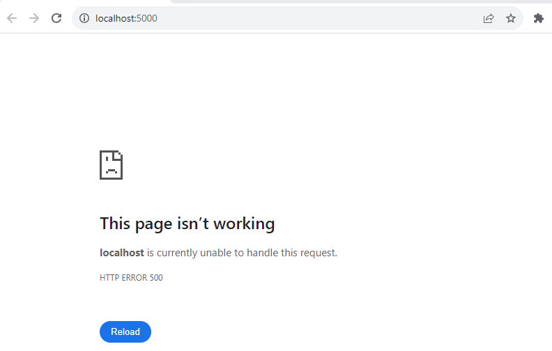

1-Introduction to Authorization
==============================

## Approach V1

```C#
//------------------V
public class Startup
{
    public void ConfigureServices(IServiceCollection services)
    {        
        // services.AddAuthentication(...);

        services.AddTransient<IAuthorizationHandler, CustomRequirementHandler>();   // all IAuthorizationHandler will be called, that's why you don't assocaite with scheme
                                                                                    // compared to IAuthenticationHandler `opts.AddScheme<AuthHandler>("qsv", "QueryStringValue")`
                                                                                    // where you do need to associate with scheme
        services.AddAuthorization(opts => {  // <--------------opts is AuthorizationOptions
            // DI registration for `IAuthorizationHandler` is only needed for user-defined IAuthorizationRequirement such as `CustomRequirement`
            opts.FallbackPolicy = new AuthorizationPolicy(new[] { new CustomRequirement() { Name = "Bob" } }, Enumerable.Empty<string>());

            // no DI registration for `IAuthorizationHandler` is needed for built-in IAuthorizationRequirement such as RolesAuthorizationRequirement
            // and AssertionRequirement as they already inherits `IAuthorizationHandler`, check Important Fact 2
            opts.FallbackPolicy = new AuthorizationPolicy
            (
                new IAuthorizationRequirement[] 
                { 
                    new RolesAuthorizationRequirement(new [] { "User", "Administrator" }),
                    new AssertionRequirement(context => !string.Equals(context.User.Identity.Name, "Bob"))
                }, 
                Enumerable.Empty<string>()
            );
        });

        services.AddRazorPages();
        services.AddControllersWithViews();
    }

    public void Configure(IApplicationBuilder app, IWebHostEnvironment env)
    {
        app.UseAuthentication();

        app.UseRouting();

        app.UseMiddleware<AuthorizationReporter>();

        app.UseEndpoints(endpoints => {
            endpoints.MapGet("/", async context => {
                await context.Response.WriteAsync("Hello World!");
            });
            endpoints.MapRazorPages();
            endpoints.MapDefaultControllerRoute();
        });
    }
}
//------------------Ʌ

//----------------------------V
public class CustomRequirement : IAuthorizationRequirement
{
    public string Name { get; set; }  // <--------------interesting, we only define properties we need to access later here, 
                                      // the actually "requirement" is defined in AuthorizationHandlerContext
}
//----------------------------Ʌ

//-----------------------------------V
public class CustomRequirementHandler : IAuthorizationHandler
{
    public Task HandleAsync(AuthorizationHandlerContext context)
    {
        foreach (CustomRequirement req in context.PendingRequirements.OfType<CustomRequirement>().ToList())
        {
            if (context.User.Identities.Any(ident => string.Equals(ident.Name, req.Name, StringComparison.OrdinalIgnoreCase)))
            {
                context.Succeed(req);
            }
        }
        return Task.CompletedTask;
    }
}
//-----------------------------------Ʌ

//--------------------------------V
public class AuthorizationReporter
{
    private string[] schemes = new string[] { "TestScheme" };
    private RequestDelegate next;

    private IAuthorizationPolicyProvider policyProvider;
    private IAuthorizationService authorizationService;

    public AuthorizationReporter(RequestDelegate requestDelegate, IAuthorizationPolicyProvider provider, IAuthorizationService service)
    {
        next = requestDelegate;
        policyProvider = provider;
        authorizationService = service;
    }

    public async Task Invoke(HttpContext context)
    {
        Endpoint ep = context.GetEndpoint();
        if (ep != null)
        {
            IEnumerable<IAuthorizeData> authData = ep.Metadata.GetOrderedMetadata<IAuthorizeData>() ?? Array.Empty<IAuthorizeData>();
            AuthorizationPolicy policy = await AuthorizationPolicy.CombineAsync(policyProvider, authData);

            Dictionary<(string, string), bool> results = new Dictionary<(string, string), bool>();
            bool allowAnon = ep.Metadata.GetMetadata<IAllowAnonymous>() != null;

            foreach (ClaimsPrincipal cp in GetUsers())
            {
                results[(cp.Identity.Name ?? "(No User)", cp.Identity.AuthenticationType)] = allowAnon || policy == null || await AuthorizeUser(cp, policy);
            }
            context.Items["authReport"] = results;
            await ep.RequestDelegate(context);
        }
        else
        {
            await next(context);
        }
    }

    private IEnumerable<ClaimsPrincipal> GetUsers() => UsersAndClaims.GetUsers().Concat(new[] { new ClaimsPrincipal(new ClaimsIdentity()) });

    private async Task<bool> AuthorizeUser(ClaimsPrincipal cp, AuthorizationPolicy policy)
    {
        return UserSchemeMatchesPolicySchemes(cp, policy) && (await authorizationService.AuthorizeAsync(cp, policy)).Succeeded;
    }
    
    private bool UserSchemeMatchesPolicySchemes(ClaimsPrincipal cp, AuthorizationPolicy policy)
    {
        return policy.AuthenticationSchemes?.Count() == 0 ||
            cp.Identities.Select(id => id.AuthenticationType)
            .Any(auth => policy.AuthenticationSchemes
            .Any(scheme => scheme == auth));
    }
}
//--------------------------------Ʌ

//--------------------------------V
public static class UsersAndClaims
{
    public static string[] Schemes = new string[] { "TestScheme" };

    public static Dictionary<string, IEnumerable<string>> UserData =
        new Dictionary<string, IEnumerable<string>> {
                { "Alice", new [] { "User", "Administrator" } },
                { "Bob", new [] { "User" } },
                { "Charlie", new [] { "User"} }
    };
    public static string[] Users => UserData.Keys.ToArray();
    public static Dictionary<string, IEnumerable<Claim>> Claims =>
        UserData.ToDictionary(kvp => kvp.Key, kvp => kvp.Value.Select(role => new Claim(ClaimTypes.Role, role)), StringComparer.InvariantCultureIgnoreCase);

    public static IEnumerable<ClaimsPrincipal> GetUsers()
    {
        foreach (string scheme in Schemes)
        {
            foreach (var kvp in Claims)
            {
                ClaimsIdentity ident = new ClaimsIdentity(scheme);
                ident.AddClaim(new Claim(ClaimTypes.Name, kvp.Key));
                ident.AddClaims(kvp.Value);
                yield return new ClaimsPrincipal(ident);

            }
        }
    }
}
//--------------------------------Ʌ
```


## Approach V2

```C#
public class Startup
{

    public void ConfigureServices(IServiceCollection services)
    {
        // ...      
        services.AddAuthorization(opts =>   // opts is AuthorizationOptions
        { 
            //----------------------------------------------------------------------------------------------------------------------> same, choose one
            //opts.FallbackPolicy = new AuthorizationPolicy(new[] { new CustomRequirement() { Name = "Bob" } }, Enumerable.Empty<string>());
            //opts.FallbackPolicy = new AuthorizationPolicy(new[] { new NameAuthorizationRequirement("Bob") }, Enumerable.Empty<string>());
            //----------------------------------------------------------------------------------------------------------------------<

            /*
            Note that the the "default policy" (when you don't set a value in AuthorizationOptions.DefaultPolicy) for `AuthorizationOptions.DefaultPolicy` is a policy who "deny anonymous access" when you use [Authorize] attribute only without specify policy like [Authorize(Policy = "UsersExceptBob")])

            There is no default policy for `AuthorizationOptions.FallbackPolicy`. FallbackPolicy applies when you don't use [Authorize] attribute. So if you don't set a value in `AuthorizationOptions.FallbackPolicy`, all reqeusts will go next middleware after AuthorizationMiddleware becuase the source code do a null check on policy and if null then call next middleware)
            */

            opts.FallbackPolicy = new AuthorizationPolicy(
                new IAuthorizationRequirement[] { new RolesAuthorizationRequirement(new[] { "User", "Adminstrator" }), new AssertionRequirement(context => !string.Equals(context.User.Identity.Name, "Bob")) },
                new string[] { "TestScheme" });

            opts.DefaultPolicy = new AuthorizationPolicy(
                new IAuthorizationRequirement[] { new RolesAuthorizationRequirement(new string[] { "Administrator" }) }, Enumerable.Empty<string>());

            //--------------------------------------------------------------------------------------------> similar, the latter uses builder pattern
            opts.AddPolicy("UsersExceptBob", new AuthorizationPolicy(
               new IAuthorizationRequirement[]
               { 
                   new RolesAuthorizationRequirement(new[] { "User" }),
                   new AssertionRequirement(context => !string.Equals(context.User.Identity.Name, "Bob")) 
               }, 
               Enumerable.Empty<string>()));

            opts.AddPolicy("UsersExceptBob", builder =>  // builder is AuthorizationPolicyBuilder
               builder
                  .RequireRole("User")
                  .AddRequirements(new AssertionRequirement(context => !string.Equals(context.User.Identity.Name, "Bob")))
                  .AddAuthenticationSchemes("OtherScheme"));
            //-------------------------------------------------------------------------------------------->
        });

        services.AddRazorPages();
        services.AddControllersWithViews();
    }

    public void Configure(IApplicationBuilder app, IWebHostEnvironment env)
    {
        // ...
    }
}
```

Noth that if you use a non-exist scheme in a policy like `opts.FallbackPolicy = new AuthorizationPolicy(new[] { new CustomRequirement() { Name = "Bob" } }, "Foo")`, since `IAuthenticationHandler` in authentication process doesn't register a "Foo" policy, it will throw an exception. check the source code of `throw await CreateMissingHandlerException(scheme)` at `AuthenticationService`, so the browser will show **500** status code rather than 401 or 403 as below picture shows:



and the console output is:

```bash
fail: Microsoft.AspNetCore.Server.Kestrel[13]
      Connection id "0HMVCTUMSL744", Request id "0HMVCTUMSL744:00000002": An unhandled exception was thrown by the application.
      System.InvalidOperationException: No authentication handler is registered for the scheme 'Foo'. The registered schemes are: Cookies. Did you forget to call AddAuthentication().Add[SomeAuthHandler]("Foo",...)?
         at Microsoft.AspNetCore.Authentication.AuthenticationService.AuthenticateAsync(HttpContext context, String scheme)
         at Microsoft.AspNetCore.Authorization.Policy.PolicyEvaluator.AuthenticateAsync(AuthorizationPolicy policy, HttpContext context)
         at Microsoft.AspNetCore.Authorization.AuthorizationMiddleware.Invoke(HttpContext context)
         at Microsoft.AspNetCore.Authentication.AuthenticationMiddleware.Invoke(HttpContext context)
         at Microsoft.WebTools.BrowserLink.Net.BrowserLinkMiddleware.InvokeAsync(HttpContext context)
         at Microsoft.AspNetCore.Watch.BrowserRefresh.BrowserRefreshMiddleware.InvokeAsync(HttpContext context)
         at Microsoft.AspNetCore.Builder.Extensions.MapWhenMiddleware.Invoke(HttpContext context)
         at Microsoft.AspNetCore.Server.Kestrel.Core.Internal.Http.HttpProtocol.ProcessRequests[TContext](IHttpApplication`1 application)
```

if you want to know how 500 status code is set, check https://source.dot.net/#Microsoft.AspNetCore.Server.Kestrel.Core/Internal/Http/HttpProtocol.cs,1049 and https://source.dot.net/#Microsoft.AspNetCore.Server.Kestrel.Core/Internal/Http/HttpProtocol.cs,600

#### Important Fact 0 - multiple `[Authorize(...)]` is AND not OR, but `[Authorize(AuthenticationSchemes = "xxx")]` is tricky

When you have mutiple `AuthorizeAttribute` like  as

```C#
public class HomeController : Controller
{
    [Authorize(Roles = "User")]
    [Authorize(Roles = "Admin")]
    public IActionResult Index() => View();

}
```

It means only users that are both of "User" and "Admin" can access to the endpoint (like `$$`), **not** either "User" or "Admin" can access.

However, it is "OR" (`||`) when it come to AuthenticationSchemes:

```C#
public class HomeController : Controller
{
    [Authorize(Roles = "Admin")]
    [Authorize(AuthenticationSchemes = "Cookies")]
    [Authorize(AuthenticationSchemes = "Foo")]
    public IActionResult Index() => View();

}

public class AuthHandler : IAuthenticationHandler  // register in Startup opts.AddScheme<AuthHandler>("Foo", "xxx");
{
    // ...
    public Task<AuthenticateResult> AuthenticateAsync()
    {
        return Task.FromResult(AuthenticateResult.NoResult());  // <------------deliberately fails the authentication process
    }
    // ...
}
```

users can access the endpoint as long as "Cookies" can authenciate (plus Role is "Admin"), it doesn't matter "Foo" doesn't authenciate


#### Important Fact 1 - How the requirements AuthorizeAttribute be part of a policy

When you use `AuthorizeAttribute` like `[Authorize(Roles = "User", ...)]` as

```C#
public class HomeController : Controller
{

    public IActionResult Index() => View();

    [Authorize(Roles = "User", AuthenticationSchemes = "OtherScheme")]
    public IActionResult Protected() => View("Test", "Protected Action");

    [AllowAnonymous]
    public IActionResult Public() => View("Test", "Unauthenticated Action");
}
```

eventually the requirements such as `Roles = "User"` will be part of policy, check the source code in b2 process you will get the idea that `AuthorizeAttribute` inherits from `IAuthorizeData` and then any requirements will be constrcuted into a policy via `AuthorizationPolicyBuilder`


#### Important Fact 2 - How does built-in IAuthorizationRequirement such as `RolesAuthorizationRequirement` get handled

when we specify `RolesAuthorizationRequirement` inside a policy, we didn't use DI to register any  related `IAuthorizationHandler`, so how does those requirements get handled? You might think the asp.net source code register all default built-in `IAuthorizationHandler` for built-in `IAuthorizationRequirement`, check `PassThroughAuthorizationHandler` you will see why built-in requirement `RolesAuthorizationRequirement` not only implements `IAuthorizationRequirement` but also `IAuthorizationHandler` (via `AuthorizationHandler`).
So `RolesAuthorizationRequirement` is both a "requirement" and also a handler:

```C#
//----------------------------------------V
public class RolesAuthorizationRequirement : AuthorizationHandler<RolesAuthorizationRequirement>, IAuthorizationRequirement
{
    public RolesAuthorizationRequirement(IEnumerable<string> allowedRoles)
    { 
        if (!allowedRoles.Any())
            throw new InvalidOperationException(Resources.Exception_RoleRequirementEmpty);
        
        AllowedRoles = allowedRoles;
    }
 
    public IEnumerable<string> AllowedRoles { get; }

    protected override Task HandleRequirementAsync(AuthorizationHandlerContext context, RolesAuthorizationRequirement requirement)
    {
        if (context.User != null)
        {
            var found = false;
 
            foreach (var role in requirement.AllowedRoles)
            {
                if (context.User.IsInRole(role))
                {
                    found = true;
                    break;
                }
            }
 
            if (found)
            {
                context.Succeed(requirement);
            }
        }
        return Task.CompletedTask;
    }
}
//----------------------------------------Ʌ

//------------------------------------------V
// at Startup.cs: services.TryAddEnumerable(ServiceDescriptor.Transient<IAuthorizationHandler, PassThroughAuthorizationHandler>());  
public class PassThroughAuthorizationHandler : IAuthorizationHandler
{
   private readonly AuthorizationOptions _options;

   public PassThroughAuthorizationHandler() : this(Options.Create(new AuthorizationOptions())) { }

   public PassThroughAuthorizationHandler(IOptions<AuthorizationOptions> options) => _options = options.Value;

   public async Task HandleAsync(AuthorizationHandlerContext context)
   {
      foreach (var handler in context.Requirements.OfType<IAuthorizationHandler>())
      {
         await handler.HandleAsync(context).ConfigureAwait(false);
         if (!_options.InvokeHandlersAfterFailure && context.HasFailed)
         {
            break;
         }
      }
   }
}
//------------------------------------------Ʌ
```

#### Important Fact 3

Authorization (i.e `IAuthorizationHandler`) still run even the users is not being authenticated in the first place, see https://stackoverflow.com/questions/77534735/why-asp-net-identity-is-deisgned-to-run-authorization-when-users-not-even-being?

This is needed to authorize anonymous users where there could be business cases that you don't need users to be authenticated (allow anonymous users) but still need to authorize them.

Also note that the source code is deign to generate "Challenge" rather than "Forbid" when both authentication and authorization fails, isn't that "Challenge" more appropriate?


## Approach V3 - Custom authorization policies with IAuthorizationRequirementData

```C#

```

## Approach V4 - Minimal API with Auth

